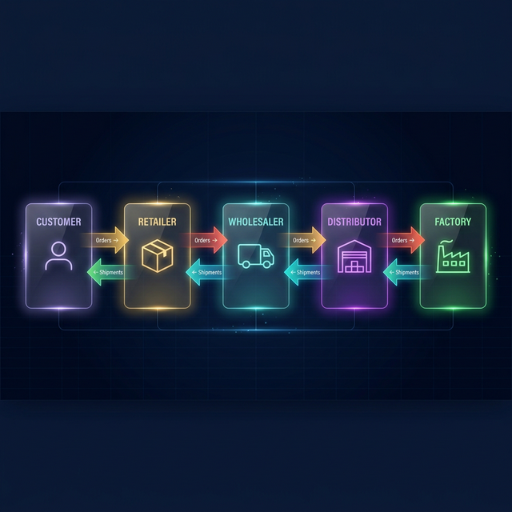
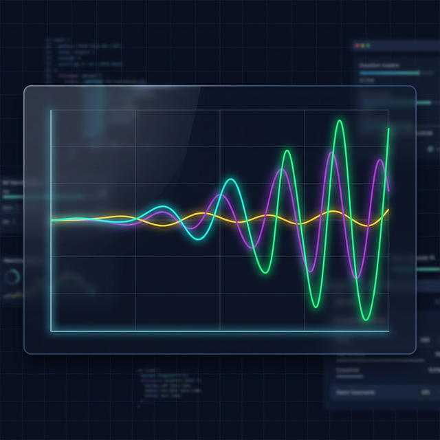

# 🎮 Oyun Kuralları — The Beer Game

---

## 🍺 Beer Game Nedir?



MIT Sloan School of Management tarafından geliştirilen **tedarik zinciri simülasyonu.**

Amaç: **Bullwhip Etkisi'ni** birinci elden deneyimlemek.

---

## 🔗 Tedarik Zinciri

Oyunda **4 rol** var. Her biri zincirin bir halkası:

| Sıra | Rol | Görev |
|------|-----|-------|
| 1️⃣ | **Retailer** (Perakendeci) | Müşteri talebini ilk gören |
| 2️⃣ | **Wholesaler** (Toptancı) | Ortada — arz ile talebi dengeler |
| 3️⃣ | **Distributor** (Dağıtımcı) | Büyük hacimli envanter yönetimi |
| 4️⃣ | **Factory** (Fabrika) | Ürünlerin kaynağı |

---

## 📋 Her Hafta Ne Yaparsın?

### 1. 📥 Sipariş Al
> Bir altındaki halkadan sipariş gelir

### 2. 📦 Sevkiyat Yap
> Elindeki stoktan mümkün olduğunca gönder

### 3. 📤 Sipariş Ver
> Bir üstündeki halkaya sipariş ver

### 4. ⏳ Bekle
> Siparişlerin ve sevkiyatların gecikmesi var!

---

## ⏱️ Gecikmeler

```
📤 Sipariş Gecikmesi:    2 hafta (varsayılan)
🚚 Sevkiyat Gecikmesi:   2 hafta (varsayılan)
```

Verdiğin sipariş **2 hafta sonra** üstündeki halkaya ulaşır.

Gönderilen ürünler **2 hafta sonra** sana gelir.

> ⚠️ Bu gecikmeler oyunun tüm karmaşıklığının kaynağı!

---

## 💰 Maliyet Hesabı

| Durum | Haftalık Maliyet |
|-------|-----------------|
| 📦 Stokta 1 birim tutmak | **$0.50** |
| 🚫 Karşılanamayan 1 birim (backlog) | **$1.00** |

**Hedef:** Toplam maliyeti **minimize** et!

---

## 🌊 Bullwhip Etkisi



### Ne oluyor?

Müşteri talebi **çok az** değişse bile:

| Zincir Halkası | Sipariş Dalgalanması |
|----------------|---------------------|
| 👤 Müşteri | ▬▬▬ (sabit) |
| 🏪 Retailer | ▬▬▬▬▬ (hafif dalgalı) |
| 🚛 Wholesaler | ▬▬▬▬▬▬▬▬ (dalgalı) |
| 🏢 Distributor | ▬▬▬▬▬▬▬▬▬▬▬ (çok dalgalı) |
| 🏭 Factory | ▬▬▬▬▬▬▬▬▬▬▬▬▬▬▬ (kaos!) |

### Neden?

- 📊 **Bilgi eksikliği** — sadece direkt müşteriyi görürsün
- ⏳ **Gecikmeler** — siparişler ve ürünler geç gelir
- 😱 **Panik siparişi** — stok azalınca aşırı sipariş verirsin
- 📈 **Amplifikasyon** — her halka bir öncekinin dalgasını büyütür

---

## 🎯 İpuçları

> 💡 **Fazla tepki verme!** Talep değiştiğinde panik yapma.

> 💡 **Pipeline'ı düşün!** Yoldaki siparişleri hesaba kat.

> 💡 **Hedef stok:** 12 birim civarı tutmaya çalış.

> 💡 **Sabit sipariş stratejisi** genellikle dalgalı stratejiden iyidir.
