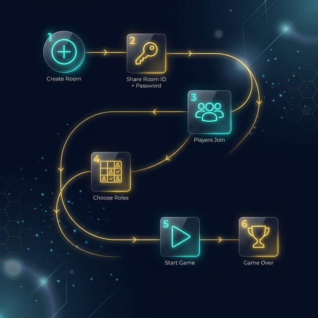
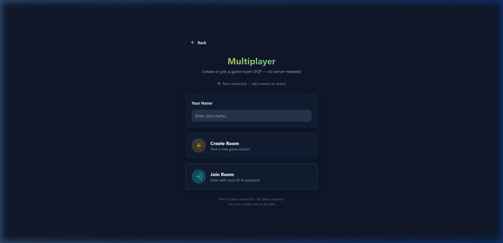

# 🌐 Multiplayer Rehberi

---

## 🎯 Genel Bakış



**4 oyuncuya kadar** gerçek zamanlı P2P bağlantı.

**Sunucu yok** — odayı açan kişi host olur.

---

## 📋 Adım Adım

---

### 1️⃣ Oda Oluşturma (Host)



1. Ana sayfada **Multiplayer** tıkla
2. İsmini gir
3. **Create Room** tıkla
4. Bir şifre belirle
5. **Create Room** butonuna bas

> 🎉 6 haneli Room ID oluşur (ör: `YF8SK6`)

---

### 2️⃣ Room ID'yi Paylaş

Arkadaşlarına iki bilgiyi ver:

```
📋 Room ID:  YF8SK6
🔑 Şifre:    ****
```

---

### 3️⃣ Odaya Katılma (Player)

1. Ana sayfada **Multiplayer** tıkla
2. İsmini gir
3. **Join Room** tıkla
4. Room ID ve şifreyi gir
5. **Join Room** butonuna bas

---

### 4️⃣ Rol Seçimi


Her oyuncu farklı bir rol seçer:

| Rol | Açıklama |
|-----|----------|
| 🏪 Retailer | Müşteriye en yakın |
| 🚛 Wholesaler | Dengeleyici |
| 🏢 Distributor | Büyük hacim |
| 🏭 Factory | Üretimin kaynağı |

> ⚠️ Her rol sadece **1 oyuncu** tarafından seçilebilir!

---

### 5️⃣ Ready & Başlatma

1. Rol seçtikten sonra **Ready** butonuna bas
2. Tüm oyuncular ready olunca → Host **Start Game** tıklar

> 💡 Minimum **2 oyuncu** gerekli. Boş roller AI tarafından oynanır.

---

### 6️⃣ Oyun İçi

Her hafta:

1. 📊 Mevcut durumunu gör (stok, backlog, gelen siparişler)
2. 📤 Sipariş miktarını gir → **Submit**
3. ⏳ Diğer oyuncuları bekle
4. 🔄 Tüm siparişler gelince → hafta otomatik ilerler

---

### 7️⃣ Oyun Sonu

Tüm haftalar bitince → **Sonuç Ekranı:**

- 🏆 Maliyet sıralaması
- 📊 Grafikler (stok, backlog, siparişler)
- 📈 Bullwhip etkisi analizi

---

## ⚡ Önemli Bilgiler

### Host Kopma Durumu

> 🔴 Host disconnect olursa **oyun biter.**

### Oyuncu Kopma Durumu

> 🟡 Bir oyuncu koparsa, o rolü **AI devralır.**

### Bağlantı Tipi

> 🟢 **WebRTC P2P** — veriler doğrudan oyuncular arasında akar. Hiçbir sunucu veri görmez.

---

## 🔧 Sorun Giderme

| Sorun | Çözüm |
|-------|-------|
| Odaya bağlanamıyorum | Room ID ve şifreyi kontrol et |
| "Room not found" hatası | Host'un uygulamasının açık olduğundan emin ol |
| Bağlantı kopuyor | Güvenlik duvarını / VPN'i kontrol et |
| Clipboard çalışmıyor | HTTPS olmadan olabilir — Room ID'yi manuel kopyala |
