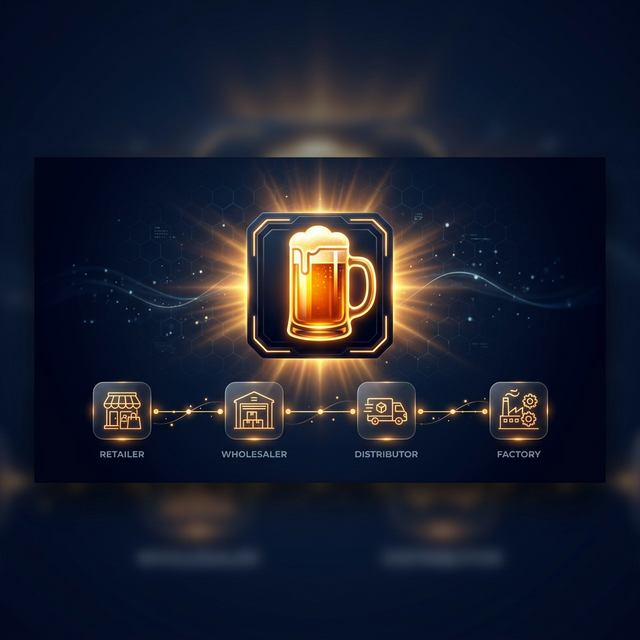
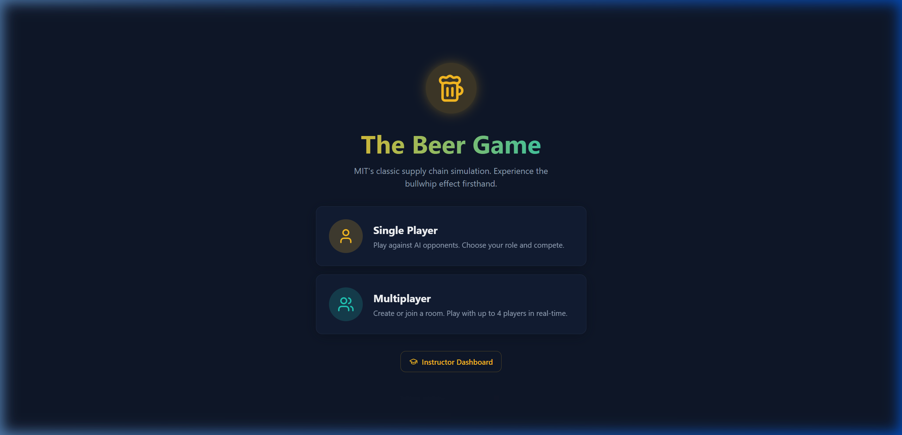
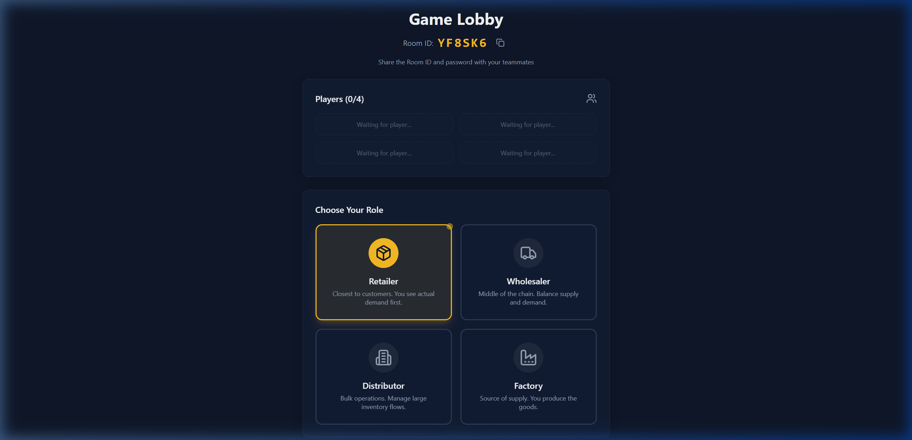
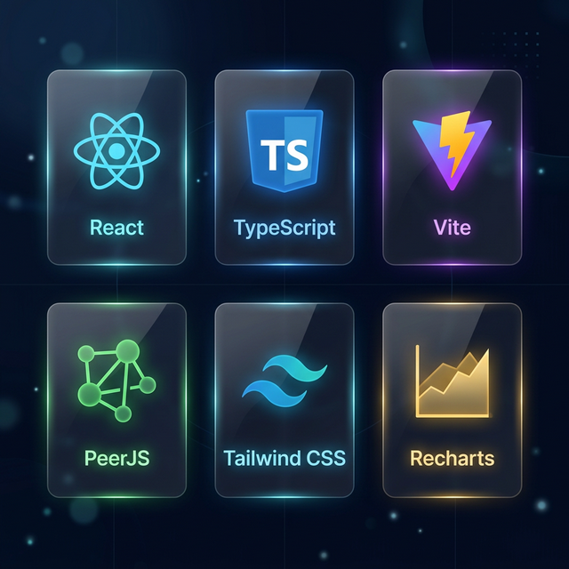

# 🍺 The Beer Game



> **MIT'nin efsanevi tedarik zinciri simülasyonu — şimdi gerçek zamanlı P2P multiplayer ile!**

---

## 📖 İçindekiler

| Doküman | Açıklama |
|---------|----------|
| [🎮 Oyun Kuralları](GAME_RULES.md) | Beer Game nedir, nasıl oynanır |
| [🌐 Multiplayer Rehberi](MULTIPLAYER_GUIDE.md) | Oda oluştur, katıl, oyna |
| [🏗️ Mimari](ARCHITECTURE.md) | P2P WebRTC mimarisi |
| [⚙️ Teknik Detaylar](TECHNICAL.md) | Kod yapısı, API'ler, tipler |

---

## 🚀 Hızlı Başlangıç

```bash
# 1. Bağımlılıkları kur
npm install

# 2. Geliştirme sunucusunu başlat
npm run dev

# 3. Tarayıcıda aç
# http://localhost:5173
```

---

## 🖼️ Ekran Görüntüleri





---

## 🛠️ Teknoloji Stack



| Teknoloji | Kullanım |
|-----------|----------|
| **React 18** | UI framework |
| **TypeScript** | Tip güvenliği |
| **Vite** | Build tool |
| **PeerJS / WebRTC** | P2P multiplayer |
| **Tailwind CSS** | Styling |
| **shadcn/ui** | UI component kütüphanesi |
| **Recharts** | Grafikler |

---

## 📁 Proje Yapısı

```
beer-chain-sim/
├── docs/                    # 📖 Dokümantasyon
├── src/
│   ├── components/
│   │   ├── game/            # 🎮 Oyun componentleri
│   │   └── ui/              # 🧩 shadcn/ui
│   ├── lib/
│   │   ├── peerService.ts   # 🌐 P2P WebRTC servisi
│   │   ├── gameLogic.ts     # 🧠 Oyun mantığı
│   │   └── utils.ts         # 🔧 Yardımcılar
│   ├── pages/               # 📄 Sayfalar
│   └── types/               # 📝 TypeScript tipleri
└── package.json
```

---

## 📜 Lisans

MIT License — Eğitim amaçlı açık kaynak proje.
